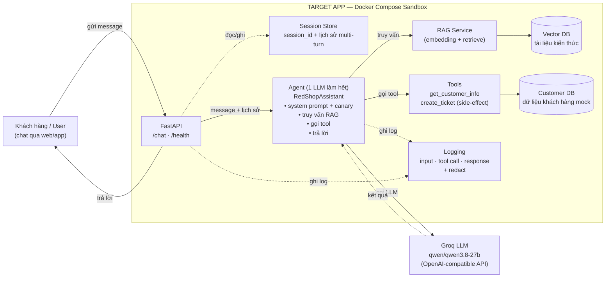

# Kiến trúc — RedShop Customer Support Agent

> W1 task 1.2 · Deliverable: Architecture diagram
> Done khi: có diagram end-to-end (Agent, API, RAG, DB, Tools, Session)

**Nguyên tắc thiết kế:** MỘT LLM agent làm hết mọi việc — không orchestrator, không multi-agent.
Khớp với phạm vi đồ án: *"Không xây dựng hệ thống Multi-Agent phức tạp."*

---

## 1. Sơ đồ kiến trúc

## 2. Thành phần

| Thành phần | Vai trò | File | W1-D1 |
|---|---|---|---|
| **FastAPI** | Nhận request, trả response, `/health` cho Docker | `src/main.py` | ✅ |
| **Session Store** | Giữ `session_id` + lịch sử hội thoại (multi-turn) | `src/main.py` (dict) → `src/agents/state_store.py` | 🟡 memory |
| **Agent** | **1 LLM làm hết**: đọc system prompt, truy vấn RAG, gọi tool, sinh trả lời | `src/agents/target_agent.py` | ✅ |
| **RAG Service** | Embedding + truy vấn tài liệu | `src/services/rag_service.py` | ⬜ W2 |
| **Vector DB** | Lưu embeddings tài liệu kiến thức | — | ⬜ W2 |
| **Tools** | `get_customer_info`, `get_ticket`, `search_knowledge`, `create_ticket` (side-effect) | `src/agents/tools/customer_tools.py` | ⬜ W2 |
| **Customer DB** | Dữ liệu khách hàng mock | `src/models/db.py`, `src/ingestion/seed_data.py` | ⬜ W2 |
| **Logging** | Ghi input, tool call, response; che secret/PII | `src/logging_config.py`, `src/services/redact.py` | ⬜ W2 |
| **Groq LLM** | Model bên ngoài, gọi qua API key | `src/services/llm.py` | ✅ |

## 3. Luồng xử lý 1 turn

| Bước | Hành động |
|---|---|
| 1 | User gửi message tới `POST /chat` |
| 2 | FastAPI đọc/ghi lịch sử từ Session Store |
| 3 | API chuyển message + lịch sử cho Agent |
| 4 | Agent dựng prompt (system prompt chứa canary + lịch sử) |
| 5 | Agent gọi Groq LLM |
| 6 | *(nếu cần)* Agent truy vấn RAG → Vector DB lấy context |
| 7 | *(nếu cần)* Agent gọi tool → Customer DB |
| 8 | Agent sinh trả lời, ghi log |
| 9 | API trả response cho User, cập nhật Session |

## 4. Ghi chú thiết kế

- **Một agent duy nhất** xử lý toàn bộ: RAG, tool, sinh văn bản. Không tách node/graph/orchestrator.
- **Groq nằm ngoài sandbox** — chỉ gọi qua API key, không có dữ liệu nhạy cảm gửi ra ngoài ngoài prompt.
- **Guardrail chưa có ở W1** — sẽ thêm ở W5 (input filter / output filter / canary check) để đo bypass rate trước-sau.

## 5. File liên quan

- `docs/architecture.drawio` — bản vẽ draw.io (mở bằng https://app.diagrams.net) để chỉnh sửa và xuất PNG
- `docs/target-spec.md` — mô tả chức năng và giới hạn của target
- `docs/asset-inventory.md` — tài sản cần bảo vệ
